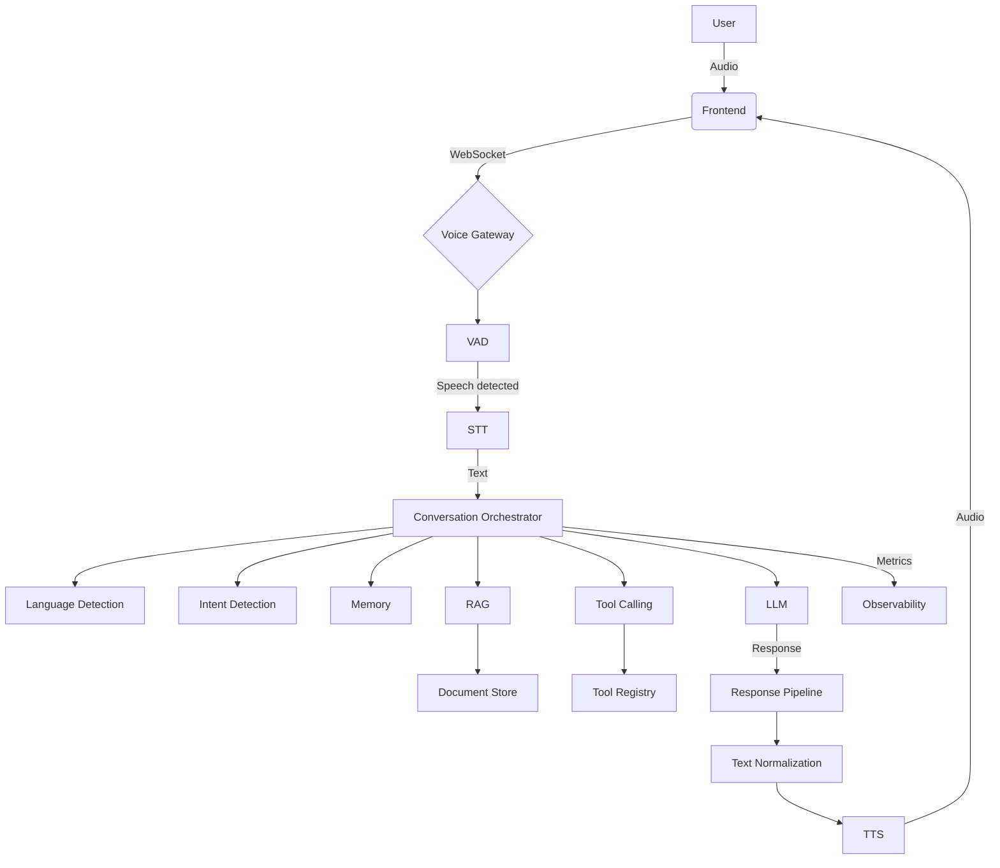
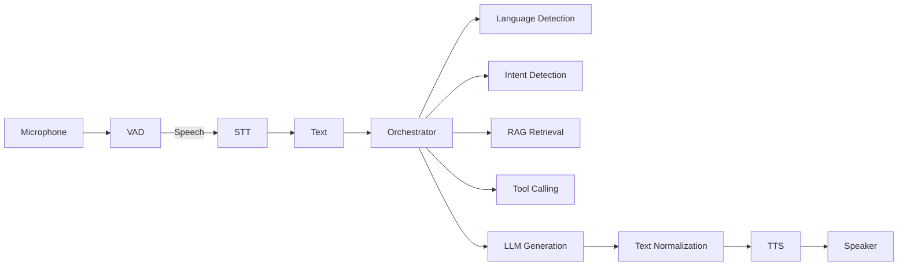
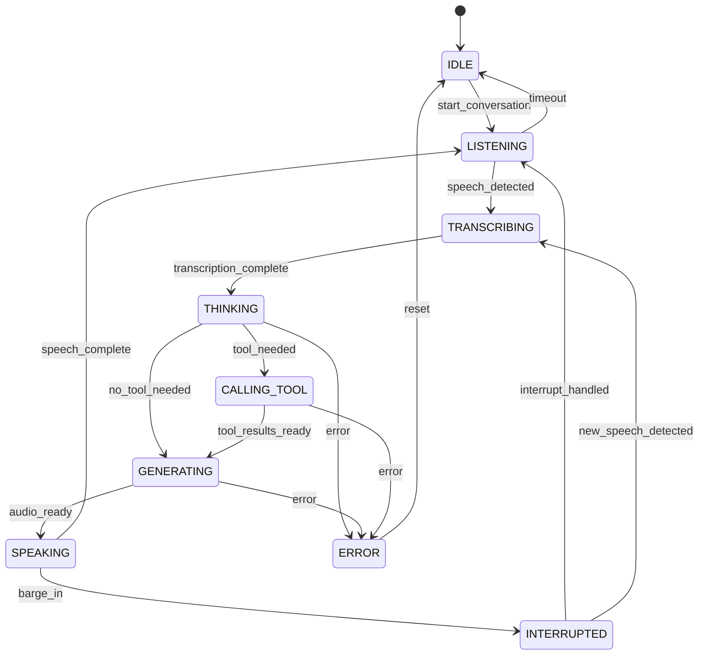
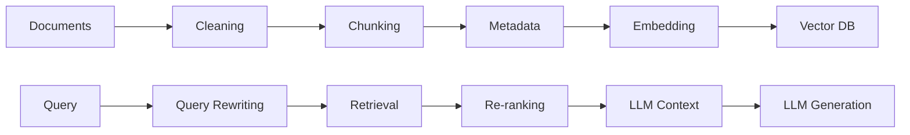
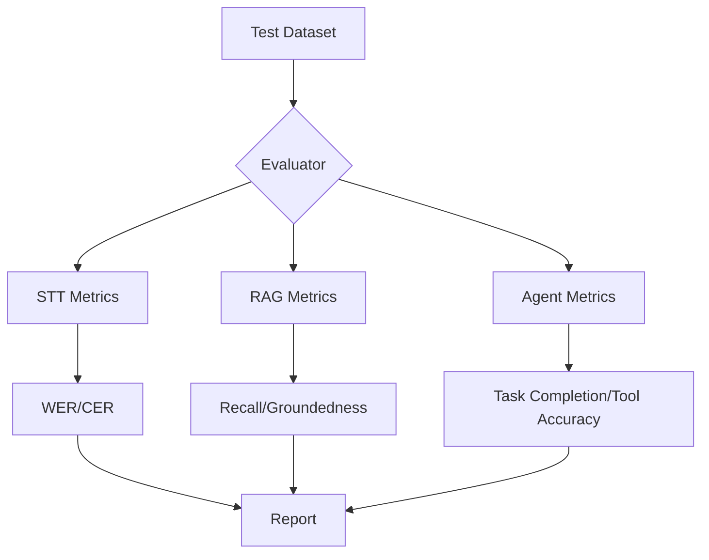

# Architecture Documentation

## System Architecture

## Voice Pipeline

## Agent State Machine

## RAG Pipeline

## Data Flow

1. **User speaks** → Audio captured via microphone
2. **VAD** detects speech → Pass audio to STT
3. **STT** transcribes → Text with language
4. **Orchestrator** processes:
   - Detect language
   - Retrieve relevant context (RAG)
   - Execute tools if needed
   - Generate response (LLM)
5. **Text normalization** → TTS-ready text
6. **TTS** synthesizes → Audio response
7. **Audio streaming** → User hears response
8. **Telemetry** recorded for evaluation

## Key Components

### Voice Gateway
- WebSocket server for real-time audio
- VAD for speech detection
- Audio buffering and management

### STT Layer
- Provider-agnostic abstraction
- Whisper-based implementation
- Language detection

### Orchestrator
- State machine for conversation flow
- Coordinates all components
- Memory management

### RAG Pipeline
- Document chunking and embedding
- Vector search and retrieval
- Re-ranking for better results

### TTS Layer
- Provider-agnostic abstraction
- Text normalization
- Streaming support

## Evaluation Architecture

