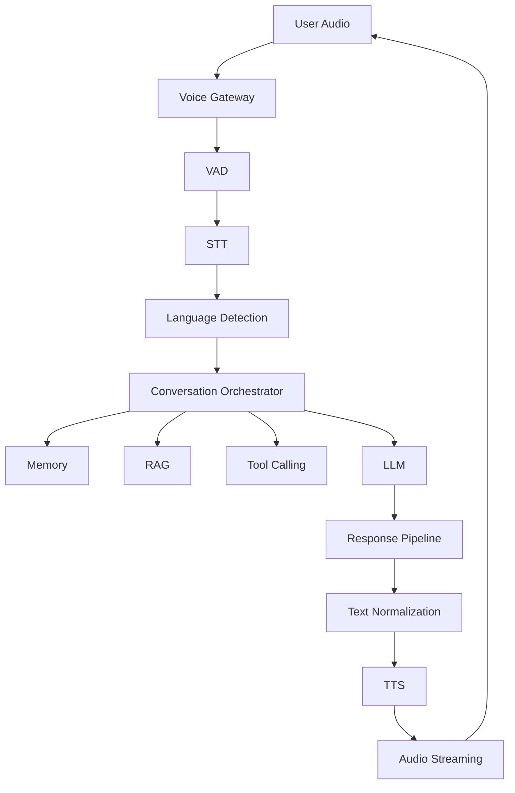

# Multilingual Indian Voice Agent

A real-time conversational AI voice agent for an Indian education counsellor, supporting English, Hindi, Hinglish, and extensible to other Indian languages.

## Project Overview

This project demonstrates a complete voice AI pipeline with:
- Real-time speech-to-text (STT) for Indian languages
- Language detection and code-switching support
- Conversational agent with tool calling
- Retrieval-Augmented Generation (RAG) for knowledge
- Text-to-speech (TTS) with Indian accent support
- Interruption handling (barge-in)
- Full evaluation and observability framework

## Architecture



## Features

- **Multilingual Support**: English, Hindi, Hinglish (code-switching)
- **Real-time STT**: Streaming transcription with language detection
- **Conversational Agent**: State-machine based orchestration
- **Tool Calling**: Course search, eligibility, fees, scheduling
- **RAG Pipeline**: Vector search over education knowledge base
- **Natural TTS**: Indian accent with text normalization
- **Barge-in Handling**: Voice activity detection for interruptions
- **Evaluation Framework**: WER, latency, groundedness, tool accuracy
- **Dashboard**: Real-time metrics and conversation inspection

## Technology Choices

| Component | Technology | Rationale |
|-----------|------------|-----------|
| STT | OpenAI Whisper (base) | Strong multilingual support, good Hindi/English accuracy |
| TTS | OpenAI TTS | High quality, streaming support |
| LLM | Anthropic Claude Sonnet 4 | Strong tool use, reasoning |
| Vector DB | ChromaDB | Local, easy setup, good performance |
| Framework | Python asyncio | Native async for real-time audio |

## Setup Instructions

### Prerequisites
- Python 3.10+
- OpenAI API key
- Anthropic API key

### Installation
```bash
# Clone and enter directory
cd Multilingual-Indian-Voice-Agent

# Create virtual environment
python -m venv .venv
source .venv/bin/activate  # Linux/Mac
# .venv\Scripts\activate   # Windows

# Install dependencies
pip install -r requirements.txt

# Configure environment
cp .env.example .env
# Edit .env with your API keys
```

### Running the Agent
```bash
# Run voice agent (terminal-based)
python -m src.main

# Run dashboard
streamlit run dashboard/app.py
```

## Demo Instructions

```bash
# Run all demos
python -m demos.run_all

# Individual demos
python demos/demo_01_english.py
python demos/demo_02_hindi.py
python demos/demo_03_hinglish.py
python demos/demo_04_tool_calling.py
python demos/demo_05_rag.py
python demos/demo_06_interruption.py
python demos/demo_07_failure_recovery.py
python demos/demo_08_dashboard.py
```

## Evaluation Results

| Metric | Target | Current |
|--------|--------|---------|
| End-to-end Latency | < 3000ms | TBD |
| STT WER (English) | < 10% | TBD |
| STT WER (Hindi) | < 15% | TBD |
| STT WER (Hinglish) | < 20% | TBD |
| Tool Call Accuracy | > 90% | TBD |
| RAG Groundedness | > 85% | TBD |

*Run `python -m evaluations.run` for current results*

## Limitations

- Requires API keys for STT/TTS/LLM
- No offline mode (all cloud-based)
- Limited to education domain
- Single-turn memory only
- No real WebRTC streaming yet

## Future Work

- [ ] Local STT (Whisper.cpp) for offline support
- [ ] Real WebRTC/WebSocket streaming
- [ ] Additional Indian languages (Tamil, Telugu, Bengali)
- [ ] Fine-tuned intent classifier
- [ ] Speaker diarization
- [ ] Production deployment (Docker, K8s)

## Project Structure

```
Multilingual-Indian-Voice-Agent/
├── README.md
├── flow.md                      # Decision log
├── ARCHITECTURE.md
├── EXPERIMENTS.md
├── EVALUATION.md
├── CHANGELOG.md
├── failure_analysis.md
├── .env.example
├── requirements.txt
├── src/
│   ├── config.py
│   ├── logger.py
│   ├── stt/
│   ├── tts/
│   ├── llm/
│   ├── agent/
│   ├── pipeline/
│   ├── gateway/
│   └── rag/
├── prompts/
├── evaluations/
├── experiments/
├── datasets/
├── knowledge_base/
├── tests/
├── dashboard/
├── docs/
└── demos/
```

## License

MIT License