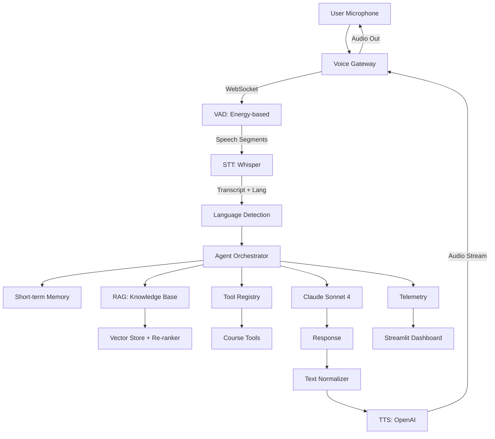

# Multilingual Indian Voice Agent

A real-time conversational AI voice agent for an Indian education counsellor, supporting
English, Hindi, Hinglish (code-switching), and extensible to other Indian languages.
Built as a portfolio-quality AI/ML internship demonstration.

## Architecture



## Components

| Component | Technology | Location |
|-----------|------------|----------|
| STT | OpenAI Whisper (base) | `src/stt/` |
| TTS | OpenAI TTS (streaming) | `src/tts/` |
| LLM | Anthropic Claude Sonnet 4 | `src/llm/` |
| RAG | LocalEmbedder + re-ranker | `src/rag/` |
| Gateway | WebSocket + VAD | `src/gateway/` |
| Agent | State machine + tools | `src/agent/` |
| Evaluations | WER, groundedness, latency | `evaluations/` |
| Dashboard | Streamlit | `dashboard/` |

## Features

- **Multilingual**: English, Hindi, Hinglish with Devanagari-ratio detector
- **RAG**: 512-char chunks, lexical re-ranker, 5 education domain documents
- **Agent**: State machine with 9 states; 5 tools (search, details, eligibility, fee, demo)
- **Text normalization**: ₹, JEE/NEET/IIT abbreviations, Indian numbering, times
- **Evaluation**: 520 tests covering all components
- **Experiment tracking**: 3 experiments (001 complete, 002 skeleton, 003 complete)
- **Failure analysis**: 13 real failures documented with root cause and fix

## Quick Start

```bash
# 1. Install
pip install -r requirements.txt

# 2. Configure
cp .env.example .env          # add OPENAI_API_KEY and ANTHROPIC_API_KEY

# 3. Run demos (no keys needed for most demos)
python demos/run_all.py

# 4. Run the evaluation suite
python -m evaluations.run

# 5. (Optional) Enable live telemetry so the dashboard shows real data
set TELEMETRY_ENABLED=true            # Windows PowerShell
# export TELEMETRY_ENABLED=true       # macOS / Linux
python -m src.main                    # or any demo; turns appended to logs/events.jsonl

# 6. Launch the dashboard
streamlit run dashboard/app.py
```

## Demos

```bash
# Run all 8 demos
python demos/run_all.py

# Run individual demos
python demos/demo_01_english.py       # single-turn English
python demos/demo_02_hindi.py         # Devanagari Hindi
python demos/demo_03_hinglish.py       # code-switching
python demos/demo_04_tool_calling.py   # tool registry
python demos/demo_05_rag.py            # real RAG pipeline (no API key)
python demos/demo_06_interruption.py   # cooperative cancellation
python demos/demo_07_failure_recovery.py # ERROR -> IDLE
python demos/demo_08_dashboard.py       # dashboard data layer
```

## Evaluation Results

| Metric | Target | Actual |
|--------|--------|--------|
| RAG retrieval recall | > 80% | **100%** (10 queries, 512-char chunks) |
| RAG keyword coverage | - | **90%** (512-char chunks) |
| Language detection accuracy | > 90% | **100%** (5 labelled samples) |
| Tool call schema validation | > 95% | ✅ (5/5 tools validated) |
| Experiment system | - | ✅ (3 experiments scaffolded) |
| Test suite | - | **520 tests passing** |
| Failure log | - | **13 failures documented** |

*Run `python -m evaluations.run` for live metrics. End-to-end STT/TTS WER requires labelled audio data.*

## Key Decisions

- **Whisper `base` model** selected over `tiny` for accuracy (experiment 001)
- **512-char chunks** selected over 256/1024 for recall + keyword coverage (experiment 003)
- **Hash-based LocalEmbedder** as default (no API key needed; OpenAIEmbedder swaps in when `OPENAI_API_KEY` is set)
- **`min_similarity_score=0.0`** — re-ranker handles quality; cosine alone is too strict for the hash embedder
- **`>= 0` filter** in vector store — non-negative scores are valid re-ranker candidates
- **State machine over implicit LLM** — agent is bounded by valid transition edges

## Project Structure

```
Multilingual-Indian-Voice-Agent/
├── src/                    # Source packages (44 .py files)
│   ├── stt/               # STT abstraction + Whisper provider
│   ├── tts/               # TTS abstraction + OpenAI provider + normalizer
│   ├── llm/               # LLM abstraction + Anthropic provider
│   ├── agent/             # State machine, tools, memory
│   ├── pipeline/          # Orchestrator, types, baseline test
│   ├── gateway/           # WebSocket server, VAD, audio utils
│   └── rag/               # Chunker, embedder, vector store, re-ranker, retriever
├── evaluations/            # Evaluator framework (stt, tts, rag, agent)
├── experiments/            # Experiment tracking (001, 002, 003)
├── failures/              # Failure analysis framework + 13 documented failures
├── dashboard/             # Streamlit metrics dashboard
├── demos/                 # 8 executable demo scripts
├── tests/                 # 15 test files, 520 tests
├── docs/research/         # 5 research papers documented
└── prompts/               # PROMPTS.md
```

## Limitations

- **No labelled audio dataset** — STT WER and TTS MOS are not yet measured
- **VAD batch processing** — true streaming (local-attention Whisper) not yet implemented
- **Half-duplex** — soft barge-in (user talks over TTS) requires WebRTC + echo cancellation
- **Single-session memory** — no cross-session persistence (Redis/PostgreSQL stub exists)

## Future Work

- [ ] Label STT evaluation dataset for WER measurement
- [ ] Implement whisper_streaming for true partial-result streaming
- [ ] WebRTC full-duplex with echo cancellation for soft barge-in
- [ ] Cross-encoder re-ranker (BGE-reranker) for RAG
- [ ] Redis-backed long-term memory
- [ ] Local Whisper.cpp for offline mode

## Documentation

| File | Purpose |
|------|---------|
| `flow.md` | Decision log with 27 sections |
| `ARCHITECTURE.md` | System diagrams and component descriptions |
| `EVALUATION.md` | Metrics definitions and methodology |
| `failures/failure_analysis.md` | 13 real failures with root cause and fix |
| `docs/research/` | 5 papers that shaped architectural decisions |
| `experiments/experiments_index.md` | Status of all experiments |

## License

MIT
