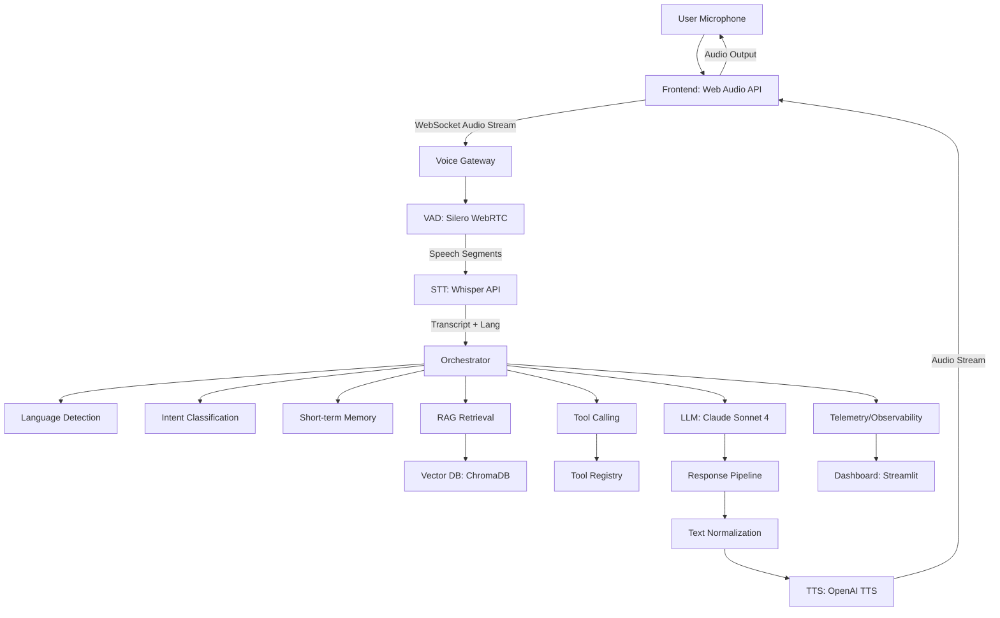

# Project Decision Log — Multilingual Indian Voice Agent

## 1. Problem Definition

Build a real-time conversational AI voice agent for an Indian education counsellor that:
- Accepts streaming audio input via WebSocket/WebRTC
- Supports English, Hindi, Hinglish (code-switching), and extensible to other Indian languages
- Detects language and code-switching in real-time
- Retrieves information from a knowledge base (courses, fees, eligibility, FAQs)
- Calls tools when required (search_courses, get_course_details, check_eligibility, get_fee_structure, schedule_demo)
- Streams audio responses with low latency
- Handles interruptions naturally (barge-in detection via VAD)
- Records telemetry and evaluates interactions (STT WER, latency, tool accuracy, groundedness)

## 2. Goals

| Goal | Metric | Target | Measurement Method |
|------|--------|--------|-------------------|
| End-to-end latency | P50 latency | < 3000ms | Wall-clock from audio end to TTS first byte |
| End-to-end latency | P95 latency | < 5000ms | Wall-clock from audio end to TTS first byte |
| STT accuracy (English) | WER | < 10% | jiwer on test set (clean) |
| STT accuracy (Hindi) | WER | < 15% | jiwer on test set |
| STT accuracy (Hinglish) | WER | < 20% | jiwer on code-switching test set |
| STT latency | Time to first token | < 500ms | STT processing time |
| Language detection accuracy | F1 score | > 90% | Manual annotation on 500 samples |
| TTS naturalness | MOS (1-5) | > 4.0 | Human evaluation (20 raters) |
| TTS latency | Time to first audio | < 500ms | Wall-clock from text to first audio chunk |
| Tool call accuracy | Correct tool + args | > 95% | Schema validation + manual check |
| RAG groundedness | Faithfulness | > 85% | Human evaluation on 100 QA pairs |
| Barge-in detection | True positive rate | > 95% | Simulated interruption test suite |
| Barge-in false positive | False positive rate | < 5% | Silent/noise audio test suite |
| Evaluation framework | Coverage | 100% | All components have automated evals |
| Dashboard | Refresh rate | < 5s | Real-time metrics visibility |

## 3. Non-Goals

- Mobile app (web-based only for MVP)
- Real payment processing (demo only)
- Student data storage beyond session (no PII persistence)
- Training custom foundation models (use existing APIs)
- Production deployment infrastructure (Docker/K8s out of scope)
- Speaker diarization (single-user assumption)
- Multi-user rooms (1:1 counselling only)

## 4. Initial Architecture

### Component Flow

**Frontend** → **Voice Gateway** → **Orchestrator** → **Response Pipeline** → **User**

**Voice Gateway Components:**
- WebSocket server for real-time audio transport
- VAD (Voice Activity Detection) for speech segmentation
- Audio buffering and format conversion

**Orchestrator Components:**
- Language Detection (from STT output + LLM)
- Intent Detection (LLM-based with tool schema)
- Short-term Memory (conversation context, user preferences)
- RAG Retrieval (vector search over knowledge base)
- Tool Calling (validated function calling)
- LLM Reasoning (Claude Sonnet 4)

**Response Pipeline Components:**
- Text Normalization (₹, %, times, acronyms, numbers)
- TTS Synthesis (streaming OpenAI TTS)
- Audio Streaming (WebSocket binary frames)

## 5. Technology Selection

[TO BE DECIDED IN PROMPTS 1.X]

## 6. STT Decision

**Problem:** Need accurate transcription for Indian English, Hindi, Hinglish.

**Options:**
1. OpenAI Whisper API (whisper-1)
2. Whisper.cpp local (base/small/medium)
3. Azure Speech Services
4. Google Cloud Speech-to-Text
5. Sarvam AI / Indic STT

**Initial Decision:** OpenAI Whisper API (whisper-1) for MVP

**Reason:** Best multilingual support, handles code-switching well, simple API, no GPU required

**Tradeoffs:** 
- Higher latency vs local (network round-trip)
- Cost per minute
- No offline capability

**Experiment:** Prompt 1.2 - Compare Whisper model sizes (tiny/base/small) for WER/latency tradeoff

**Follow-up:** Evaluate local Whisper.cpp for production latency optimization

## 7. TTS Decision

**Problem:** Natural-sounding TTS for Indian English, Hindi, Hinglish with proper pronunciation.

**Options:**
1. OpenAI TTS (alloy/echo/fable/nova/shimmer)
2. ElevenLabs (Indian voices)
3. Sarvam AI TTS
4. Coqui TTS (local)
5. Google Cloud TTS (Indian voices)

**Initial Decision:** OpenAI TTS (voice: alloy/echo) for MVP

**Reason:** Good quality, streaming support, simple API, handles English+Hindi mixed text reasonably

**Tradeoffs:**
- Limited Indian accent control
- No voice cloning
- Cost per character

**Experiment:** Prompt 1.3 - Compare TTS providers for Indian language naturalness

**Follow-up:** Test ElevenLabs/Sarvam for better Indian accent

## 8. LLM Decision

**Problem:** Need strong tool use, reasoning, multilingual support for education domain.

**Options:**
1. Anthropic Claude Sonnet 4
2. OpenAI GPT-4o
3. GPT-4o-mini
4. Local Llama 3.1 (via Ollama/vLLM)

**Initial Decision:** Anthropic Claude Sonnet 4

**Reason:** Best-in-class tool use, strong reasoning, good multilingual, large context window

**Tradeoffs:**
- Higher cost vs GPT-4o-mini
- No local option
- Rate limits

**Experiment:** Prompt 1.4 - Compare GPT-4o-mini for cost/latency optimization

**Follow-up:** Evaluate local Llama for privacy/offline scenarios

## 9. Vector Database Decision

**Problem:** Store and retrieve education domain knowledge efficiently.

**Options:**
1. ChromaDB (local, embedded)
2. Qdrant (local Docker)
3. Pinecone (managed)
4. Weaviate (local Docker)
5. FAISS + SQLite

**Initial Decision:** ChromaDB (local, embedded)

**Reason:** Zero-config, Python native, good for prototyping, supports metadata filtering

**Tradeoffs:**
- Single-node only
- Limited scalability
- No built-in auth

**Experiment:** Prompt 4.1 - Benchmark ChromaDB vs Qdrant for recall/latency

**Follow-up:** Migrate to Qdrant/Pinecone for production scale

## 10. RAG Decision

**Problem:** Retrieve relevant course/fee/eligibility info for LLM context.

**Options:**
1. Naive vector search (cosine similarity)
2. Vector + BM25 hybrid
3. Vector + cross-encoder reranking
4. Query rewriting + retrieval
5. GraphRAG (knowledge graph)

**Initial Decision:** Vector search (cosine) + metadata filtering for MVP

**Reason:** Simple, fast, good baseline. Add reranking later if needed.

**Tradeoffs:**
- May miss relevant docs with poor embeddings
- No semantic reranking
- Chunk size sensitivity

**Experiment:** Prompt 4.1 / 003 - Chunk size (256/512/1024), overlap, reranking

**Follow-up:** Add cross-encoder reranking (bge-reranker) for production

## 11. Agent Architecture Decision

**Problem:** Orchestrate multi-step conversation with state management.

**Options:**
1. Simple sequential (STT→LLM→TTS)
2. State machine with explicit states
3. LangGraph / LangChain agent
4. Custom event-driven orchestrator

**Initial Decision:** Custom state machine (Prompt 3.1)

**Reason:** Full control over barge-in, streaming, telemetry; minimal dependencies

**Tradeoffs:**
- More boilerplate vs frameworks
- Manual state management
- Need to handle edge cases

**Experiment:** Prompt 3.1 - Implement states: IDLE, LISTENING, TRANSCRIBING, THINKING, CALLING_TOOL, GENERATING, SPEAKING, INTERRUPTED, ERROR

**Follow-up:** Evaluate LangGraph for complex multi-agent workflows

## 12. Tool Calling Decision

**Problem:** LLM needs to call structured functions for course data.

**Options:**
1. OpenAI function calling format
2. Anthropic tool use format
3. Custom JSON schema + parser
4. LangChain tools

**Initial Decision:** Anthropic tool use format (native to Claude)

**Reason:** Native support, automatic validation, streaming tool results

**Tradeoffs:**
- Provider-specific
- Need adapter for other LLMs

**Experiment:** Prompt 3.1 - Implement tool registry with validation, timeout, retry

**Follow-up:** Standardize on OpenAI format for portability

## 13. Memory Decision

**Problem:** Maintain conversation context and user preferences.

**Options:**
1. Full conversation history in context
2. Sliding window (last N turns)
3. Summary + recent turns
4. Structured memory (facts + preferences)
5. Long-term vector memory

**Initial Decision:** Sliding window (10 turns) + structured user context dict

**Reason:** Simple, token-efficient, captures key preferences (language, exam interest, class)

**Tradeoffs:**
- Loses long-term context
- No cross-session persistence
- Manual context management

**Experiment:** Prompt 3.1 - Test window sizes (5/10/20 turns) for context retention

**Follow-up:** Add summary memory for longer conversations

## 14. Streaming Decision

**Problem:** Stream audio for real-time feel.

**Options:**
1. Full duplex WebSocket
2. Half-duplex (request/response)
3. WebRTC for ultra-low latency
4. Server-Sent Events + WebSocket

**Initial Decision:** Half-duplex WebSocket (simpler MVP)

**Reason:** Easier to implement, sufficient for turn-based conversation

**Tradeoffs:**
- Can't handle true barge-in during TTS
- Higher perceived latency

**Experiment:** Prompt 2.1 - Implement WebSocket streaming with VAD-based interruption

**Follow-up:** Migrate to WebRTC for true full-duplex barge-in

## 15. VAD / Barge-In Decision

**Problem:** Detect user speech during agent TTS playback to interrupt.

**Options:**
1. Silero VAD (ONNX, fast)
2. WebRTC VAD (simple, fast)
3. Custom energy-based VAD
4. Whisper timestamp-based

**Initial Decision:** Silero VAD (ONNX) for accuracy, WebRTC VAD as fallback

**Reason:** Better accuracy on noisy audio, supports 16kHz, fast inference

**Tradeoffs:**
- Requires ONNX runtime
- More complex than energy-based

**Experiment:** Prompt 2.1 - Tune threshold (0.3/0.5/0.7), min_speech (150/250/350ms)

**Follow-up:** Combine with acoustic echo cancellation for robustness

## 16. Dataset Decisions

**Problem:** Need evaluation data for Indian languages.

**Options:**
1. Curate custom dataset (record/annotate)
2. Use public datasets (MuST-C, IndicTTS, VoxPopuli)
3. Synthetic data generation (TTS + translation)
4. Crowdsourcing

**Initial Decision:** Custom dataset (Prompt 0.1) + public benchmarks

**Reason:** Domain-specific (education), realistic noise, code-switching

**Experiment:** Prompt 0.1 - Record 100 samples each: English, Hindi, Hinglish

**Follow-up:** Expand to Tamil/Telugu/Bengali

## 17. Evaluation Decisions

**Problem:** Measure system quality objectively.

**Options:**
1. Custom eval scripts (Prompt 5.1)
2. RAGAS for RAG
3. LangSmith for tracing
4. Custom dashboard (Streamlit)

**Initial Decision:** Custom evaluation framework + Streamlit dashboard

**Reason:** Full control, domain-specific metrics, no external dependency

**Experiment:** Prompt 5.1 - Implement WER, groundedness, tool accuracy, latency evals

**Follow-up:** Integrate RAGAS for standardized RAG metrics

## 18. Prompt Engineering Decisions

**Problem:** Optimize system prompts for education counselling.

**Options:**
1. Single monolithic system prompt
2. Modular prompts (system + tool + multilingual)
3. DSPy / prompt optimization
4. Few-shot examples

**Initial Decision:** Modular versioned prompts (v1 in Prompt 1.4)

**Reason:** Testable, versionable, separable concerns

**Experiment:** Prompt 1.4 / 004 - A/B test prompt versions

**Follow-up:** Use DSPy for automated prompt optimization

## 19. Model Training Decisions

**Problem:** Improve domain-specific accuracy via fine-tuning.

**Options:**
1. Fine-tune Whisper on Indian English
2. Fine-tune intent classifier (DistilBERT)
3. Fine-tune embedding model
4. LoRA fine-tune Llama for agent
5. TTS voice adaptation

**Initial Decision:** Intent classifier fine-tuning (Prompt 10.1) if baseline < 90%

**Reason:** Highest ROI, small model, clear labels, measurable improvement

**Experiment:** Prompt 10.1 - 500 labeled examples, DistilBERT, compare vs zero-shot

**Follow-up:** Whisper fine-tuning if WER targets not met

## 20. Infrastructure Decisions

**Problem:** Host and serve the application.

**Options:**
1. Local development only
2. Docker Compose (local prod-like)
3. Cloud VM (AWS/GCP/Azure)
4. Serverless (Cloud Run, Lambda)
5. Kubernetes (EKS/GKE)

**Initial Decision:** Local dev + Docker Compose for integration testing

**Reason:** Free, fast iteration, matches production structure

**Experiment:** Prompt 0.1 - Dockerfile for each service

**Follow-up:** Deploy to Cloud Run for demo accessibility

## 21. Security Decisions

**Problem:** Protect API keys and user data.

**Options:**
1. .env file (dev)
2. Secret manager (prod)
3. Key rotation
4. Input validation/sanitization
5. Rate limiting

**Initial Decision:** .env for dev, secret manager for prod, Pydantic validation

**Reason:** Standard practice, zero-cost for dev

**Experiment:** Prompt 0.1 - Implement input validation, rate limits on tools

**Follow-up:** Add auth (OAuth/JWT) for multi-user

## 22. Latency Optimization Decisions

[To be determined throughout - tracked per component in experiments]

## 23. Failed Experiments

[To be determined throughout]

## 24. Decision Reversals

[To be determined throughout]

## 25. Current Architecture

[Current implementation based on prompts completed - updated after each phase]

## 26. Known Limitations

[To be determined throughout]

## 27. Future Experiments

[To be determined throughout]

---

Last updated: 2024-09-07